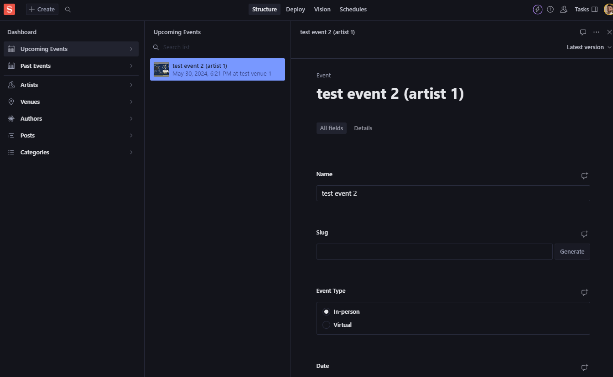

# NextJS+Sanity web project

This is a [Next.js](https://nextjs.org/) project with [Sanity Studio](https://www.sanity.io/) dashboard. A simple web app that has implementation of some basic future PoCs for the dashboard.


## Getting Started

Consider updating environment variables that you can find in `.env.example` file.  
Then, run the development server:

```bash
npm run dev
# or
yarn dev
# or
pnpm dev
# or
bun dev
```

## Generate types for the frontent

Run the following Sanity CLI command in your studio project folder:  
`npx sanity schema extract`  
If your command ran successfully, you should see a new file called `schema.json` in your Studio project folder. In this course, you will only use this file for the type generation; you don’t need to do anything else with it.  
You do this by running this Sanity CLI command:  
`npx sanity typegen generate`  
When successfully completed, this command creates a `sanity.types.ts` file containing TypeScript types for all your Sanity Studio schema types. Open it to find types for “built-in” schema types. If you have plugins with schema types, those will also be generated.  
Before you can generate types for GROQ query results, you must add some configuration that tells the TypeGen tooling where to look for those queries and where to put the file with the generated types.  
Before diving in, it’s important to remember that you are still dependent on the `schema.json` file to generate types for your front end. You should also keep in mind that every time you change the Studio’s schema, you will have to rerun the extraction, and every time you change a GROQ query, you should update your types as well.  
Make a new file called `sanity-typegen.json` in your Studio folder and paste the following configuration into it:

```json
// /sanity-typegen.json
{
  "path": "'./sanity/**/*.{ts,tsx,js,jsx}'",
  "schema": "schema.json",
  "generates": "/src/types/sanity.ts"
}
```

With this configuration file in place, you can now run the `typegen` command:

`npx sanity typegen generate`

## Learn More

To learn more about Next.js, take a look at the following resources:

- [Next.js Documentation](https://nextjs.org/docs) - learn about Next.js features and API.
- [Learn Next.js](https://nextjs.org/learn) - an interactive Next.js tutorial.

You can check out [the Next.js GitHub repository](https://github.com/vercel/next.js/) - your feedback and contributions are welcome!

## Deploy on Vercel

`vercel deploy`  
The easiest way to deploy your Next.js app is to use the [Vercel Platform](https://vercel.com/new?utm_medium=default-template&filter=next.js&utm_source=create-next-app&utm_campaign=create-next-app-readme) from the creators of Next.js.

Check out our [Next.js deployment documentation](https://nextjs.org/docs/deployment) for more details.
